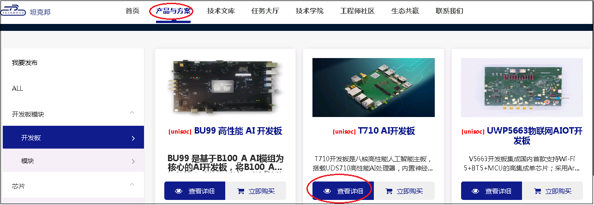
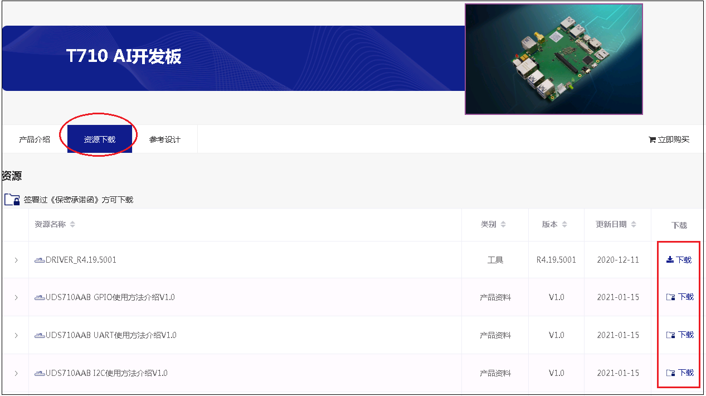
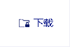
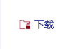
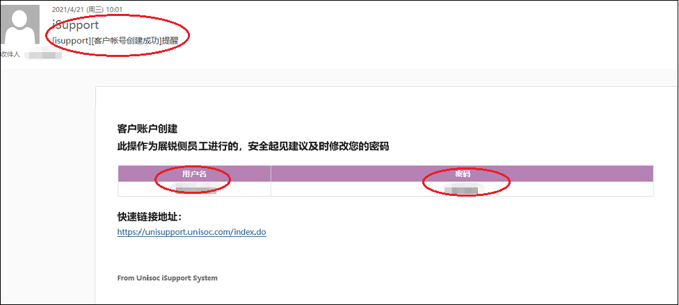
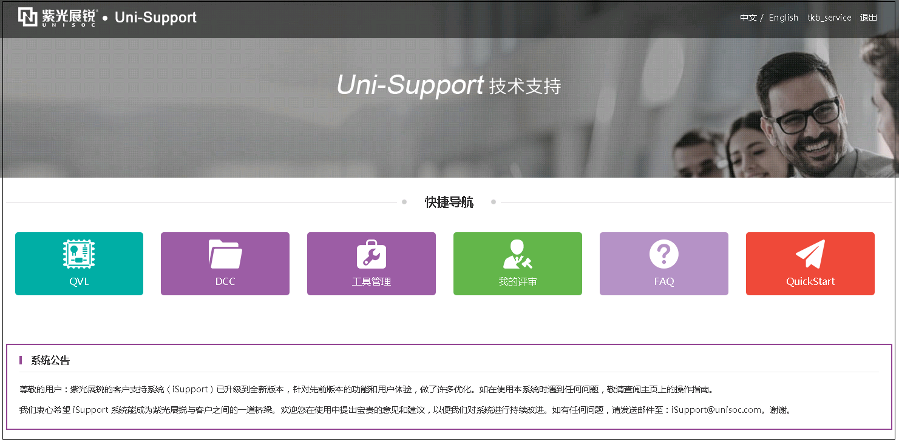

坦克邦平台提供了各种产品相关的软件和硬件资料供客户开发参考。建议客户开发前，务必仔细查阅相关资料。
针对不同的产品类型，坦克邦提供了三种资料获取途径。

## 途径一：从“产品与方案”中获取

对于`开发板、模块和生态类产品`，可以在坦克邦主页`产品与方案`中获取相关资料。
单击`产品与方案-查看详细-资源下载`即可查看相应产品的资料，点击右侧`下载`按键即可下载。

对于不同等级的资料，需要不同的下载权限。只有拥有相应权限的用户才能下载相应的资料。上图中`下载`图标的不同形状对应不同的资料等级和下载权限。

| 下载图标 | 说明 |
| ------ | ---- |
|        |  推广资料，注册用户都可以下载    |
|        |  完成企业实名认证，且签署NDA的用户可以下载    |
|        |  完成企业实名认证，且签署相应产品License协议的用户可以下载    |

## 途径二：从Uni-Support获取

对于`芯片类产品`，坦克邦会给在线上或线下签署了芯片产品License协议，并完成企业实名认证的用户创建Uni-Support账号，并开通其在Uni-Support系统上相关产品的文档和FAQ访问权限。

Uni-Support账号创建后，客户在坦克邦的注册邮箱会收到一封来自iSupport的`[客户账号创建成功]`的邮件提醒，如下：

使用邮件中的“用户名”和“密码”登录[Uni-Support](https://unisupport.unisoc.com/index.do)后，可以获取相关芯片产品资料。

- DCC：文档，包含芯片规格说明书，硬件原理图，设计指导文档，调试指导文档，客制化指导手册等
- FAQ：问答，包含硬件和软件常见问题解答
- 工具管理：工具，包含展锐芯片平台所有的工具
- QVL：器件认证列表

## 途径三：从“技术文库”获取

坦克邦技术文库提供了收费文档和问答，是与Uni-Support差异化的文档系统。如果客户在`产品与方案`和`Uni-Support`中未找到需要的资料，可以尝试在`技术文库`查询。相关操作方法请见[技术文库](/techdoc#下载文档/问答)章节。

