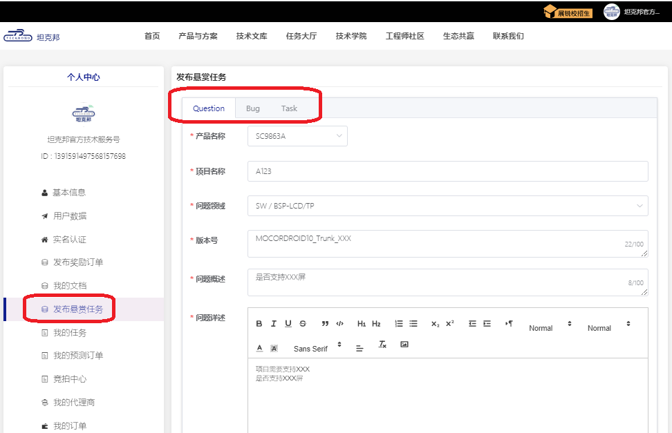
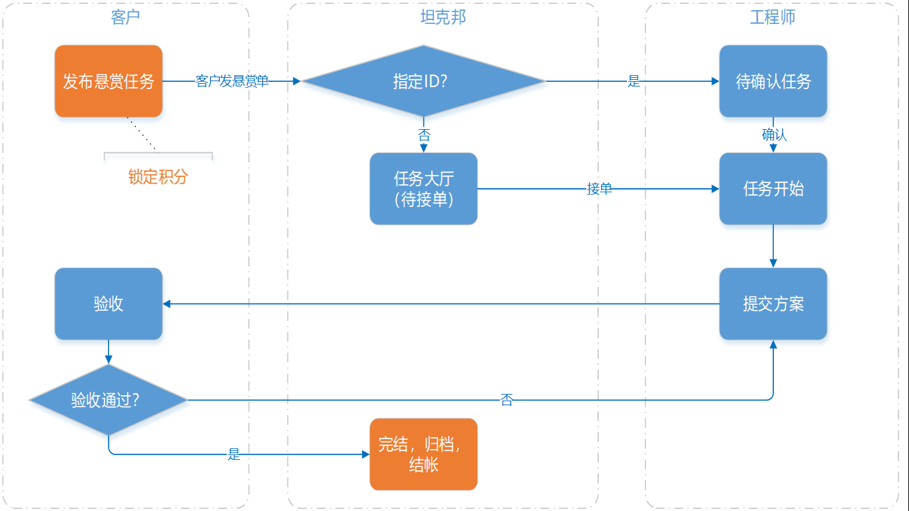
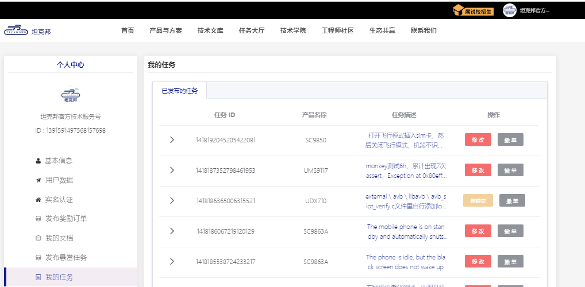

线上或者线下签署产品License，登录坦克邦完成企业实名后，即可充值后。通过发布悬赏任务的方式将自己遇到的问题发布到任务大厅。

## 发布悬赏任务

打开个人中心，点击“发布悬赏任务”，选择Question/Bug/Task，填写任务表单

- Question为一些咨询类问题，比如“是否支持T卡热插拔”。
- Bug为常规问题支持，比如“配置了xx，还是无法打开XXX”。
- Task为调试任务，比如“Camera调试”。
- 

## 悬赏任务解决流程

悬赏任务解决的流程是客户发任务 -> 工程师接单

## 悬赏任务跟踪和处理

在个人中心，我的任务中查看已经发布的任务，点击任务描述可以查看沟通记录，执行操作一栏的按钮可以修改、验收和申请撤单。

- 待提交 ---- 工程师已经接单。

- 待验收 ---- 工程师已经提交方案，等待验收。

- 已完成 ---- 验收成功。

- 已驳回 ---- 验收失败。

- 超时 ---- 超过最晚接单时间，自动下架。

- 已撤单 ---- 主动撤单下架。

## 问题定价

问题价格原则上遵循`市场机制`，通常价格越高，被工程师快速接单的几率越高。

问题定价主要遵循以下几个原则：
- 系统最低价格：
  - Question：最低不低于`10`积分
  - Bug/Task：最低不低于`100`积分

- 历史价格：系统上已解决问题的单个平均价格在800积分左右。

建议客户结合问题的`紧急程度`以及`复杂程度`，设置悬赏积分为`500-1500`左右。当然，如果发出悬赏单超过一段时间仍无工程师接单，也可以撤销后，提高价格重新发起悬赏。

## 注意事项

### 产品

悬赏任务中可以选择的产品是已签了License的产品，如果产品没有显示出来，请联系销售或管理员。

### 指定接单人

发悬赏任务的时候，可以填写接单人的ID，指定给他，该接单工程师可以在24小时内接下这个单子，超过24小时，单子退到任务大厅。

### 任务描述

提交悬赏任务时，需要把版本号、问题现象、复现步骤、概率等描述清楚，并提供完整的log，最好附上截图或者视频。

### 任务积分

任务单的悬赏积分不可以修改，如需追加积分，可以另提一单，选择指定接单人给对应工程师。

