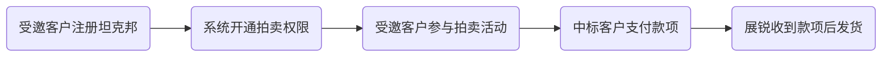

## 背景

为了满足部分客户的业务需求，坦克邦平台试行针对受邀客户进行产品拍卖业务。通常每月会进行两次拍卖活动，分别在上半月和下半月，系统会在拍卖开始前通过邮件或短信等方式通知客户。

## 拍卖流程

通常整个拍卖流程会分为如下几个阶段：

受邀客户注册坦克邦时，请参考[注册认证](/registration#注册认证)章节操作。注册认证过程中，有任何疑问，均可联系对接的销售经理。

## 拍卖规则

- 通常`每月10号`和`每月25号`会举行线上拍卖活动，系统会在`拍卖前5天`通过`邮件`和`短信`邀请意向客户注册并参于拍卖活动。

 > [!tip]
 > 如果当月10号或25号为非工作日，则拍卖活动顺延到下一个工作日举行。

- 对于开通了拍卖权限的客户，系统会在`拍卖前1小时`通过`邮件`和`短信`提醒客户及时参与拍卖活动。

- 每场拍卖会进行`三轮`，具体每轮拍卖的起止时间会在拍卖页面醒目展示。

- 每位参拍客户`每轮仅允许出价一次`， 该轮结束后会在拍卖页面上展示本轮最高 价。 次轮开始起拍价恢复为`初始价格`重新开始起拍 。

- 拍卖时出价为`单片价格`，单位为`美元(含税)`。用户出价金额不能低于起拍价，不做上限要求。拍卖页面中会展示用户的出价记录。

- 最终中标以`第三轮出价最高者`获得。若多名参拍者出现相同最高价，最早出价者竞标成功。

 > [!tip]
 > 若第三轮无人出价，则以第二轮出价最高且最早的参拍者中标，若第二轮无人出价，则以第一轮出价最高且最早的参拍者中标，以此类推。

- 中标后，中标客户需要在坦克邦页面填写`发票信息`和`收货地址`等信息。

- 竞拍结束后，系统会在`10分钟`内会向中标客户发送`中标邮件`和`短信`通知，提醒后续操作流程。

## 常见问题

- **问：中标后我又不想要了怎么办？**

  答：对于中标后弃标的客户，会实行`惩罚机制`:**从该次拍卖起一个季度内不得参与坦克邦任何拍卖活动**。

您有任何意见或者建议，欢迎通过[联系我们](https://www.teckbond.com/#/home/serve)页面反馈给我们。
