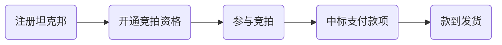

## 竞拍流程

竞拍流程分为如下几个阶段：

受邀客户注册坦克邦时，请参考[注册认证](/registration#注册认证)章节操作。

过程中如有任何疑问，请扫描下方`坦克邦小助手`二维码咨询。

## 竞拍规则

- 坦克邦线上竞拍当前规则仍在试运行期间，暂定于`每月 10 号`及`每月 25 号`举行线上竞拍活动，后续如有调整，坦克邦平台将以邮件及短信的方式及时告知客户。
 > [!tip]
 > 如果当月 10 号或 25 号为非工作日，则竞拍活动顺延到下一个工作日举行。

- 展锐将根据客户及市场的实际情况灵活调整每次参拍的芯片平台种类、数量、及场次，具体以每次竞拍前的`邮件`邀请内容为准。

- 每场竞拍均设`三轮`竞价机制，每个客户认证账号`每轮只能出价一次`，每轮竞拍结束后，平台会公示每轮的最高出价。

- 每轮的起拍价均为初始价格。起拍价为`单片`价格，单位为`美元`，页面同时会显示人民币价格及含税价。用户出价金额不能低于起拍价，不做上限要求。竞拍页面中会展示用户自己的出价记录。

- 最终中标以`第三轮出价最高者`获得。若多名参拍者出现相同最高价，最早出价者竞标成功。
 > [!tip]
 > 若第三轮无人出价，则以第二轮出价最高且最早的参拍者中标，若第二轮无人出价，则以第一轮出价最高且最早的参拍者中标，以此类推。

- 竞拍结束后，系统会在 `10 分钟内`向中标客户发送`中标邮件`和`短信`通知，提醒后续操作流程。

- 中标客户需要在坦克邦页面填写`发票信息`和`收货地址`等信息。

- 每个客户认证账号最多只能参加 `2 个平台`的竞拍，且中拍次数`不得多于 2 次`。
 > [!tip]
 > 举例：某次竞拍活动推出 SC9863A、SL8541E、SC7731E 这 三个平台，每个平台分别设 4 场竞拍，则总共有 12 场竞拍。假设 A 客户 SC9863A 中拍了 2 次，则该客户不能再参加其他 两个平台的竞拍；如果 A 客户 SC9863A 仅中拍了 1 次，那么该客户还有 1 次中拍的额度可以用于其他两个平台的竞拍。

- 坦克邦平台将在竞拍前  ` 7 天`、竞拍前  ` 3 天`及竞拍前 ` 1 小时`通过邮件和短信的方式向受邀客户发出竞拍活动的邀请及告知相关详细信息，包括芯片平台、数量、场次以及竞拍的具体规则等。

## 展锐对弃标行为的规定

对于中标后又弃标的行为，展锐将实行惩罚机制:`从该次竞拍起一个季度内，禁止弃标客户参与展锐坦克邦的任何芯片竞拍活动`。
