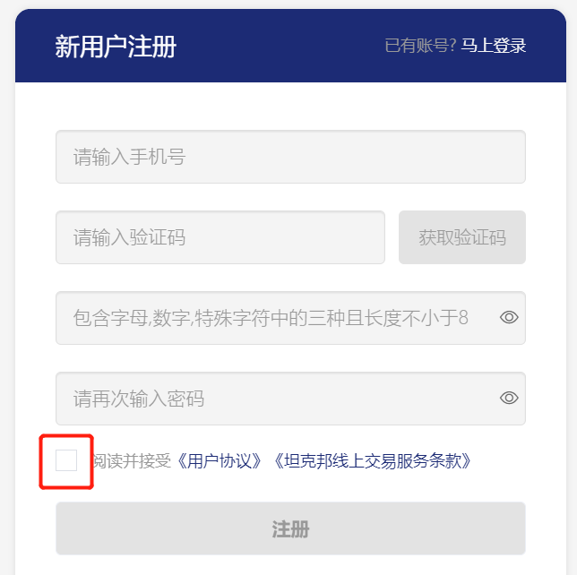
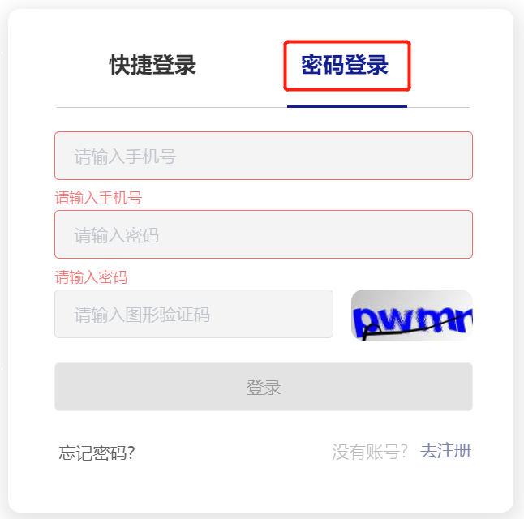
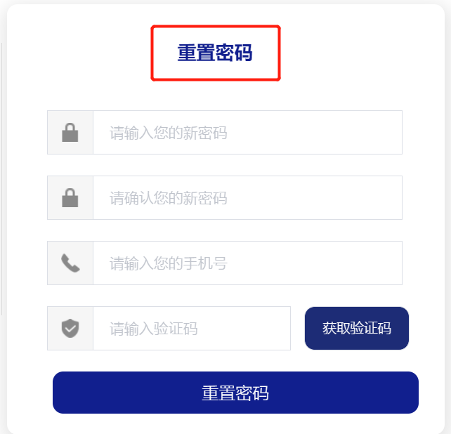

# 注册认证

当前坦克邦平台暂时仅支持 `中国大陆手机号` 注册，仅支持`中国大陆居民身份证` 和`中国大陆企业营业执照`进行实名认证 。


## 注册和登录

### 注册

若您还没有`坦克邦`账号，可按如下方式进行注册。


####  快捷注册

1. 打开坦克邦首页，点击右上角`登录`按钮，进入[登录页面](https://www.teckbond.com/portal/html/#/home/loginDL?ex=1334379650155085825)。


2. 进入登录页面，选择[快捷登录](#快捷登录)，通过`手机号+短信验证码`进行快捷注册。


```
首次快捷登录后，系统会生成一个默认密码，该密码会以短信形式发送至您的注册手机上，后续您可使用该密码进行登录。
```


####  密码注册

1. 打开坦克邦首页，点击右上角`注册`按钮，进入[注册页面](https://www.teckbond.com/portal/html/#/home/registerPage?ex=1334379650155085825)。


2. 进入注册页面，请输入您的手机号进行注册，同时设置登录密码；注册时需`阅读并接受`《用户协议》等相关协议。




###  身份角色

**注册成功后，您可根据您的实际情况，预先选择您在坦克邦平台的`身份角色`，说明如下：**

- `个人身份`
  - 工程师：可在平台参与技术讨论，还可为有需求客户提供技术支持和方案，获取业务收益。
  - 学生：可在平台参与技术问题讨论，还可在技术学院学习相关行业知识。
  - 其他：工程师和学生之外的个人用户。
- `企业身份`
  - ODM/OEM/IDH/模组厂商：可在平台发布产品和方案，可在线寻求技术支持。
  - 终端品牌商：可在平台发布产品和方案。
  - 技术服务商：可在平台为有需求客户提供技术支持和方案，获取业务收益。
  - 渠道商：可在平台为自己的客户提供代办、物流、资金等服务。
  - 其他：非以上几类的企业用户。


### 登录


####  快捷登录

1. 打开坦克邦首页，点击右上角`登录`按钮，进入[登录页面](https://www.teckbond.com/portal/html/#/home/loginDL?ex=1334379650155085825)。


2. 进入登录页面，您可通过`手机号+短信验证码`，直接登录您的账户。


####  密码登录

1. 打开坦克邦首页，点击右上角`登录`按钮，进入[登录页面](https://www.teckbond.com/portal/html/#/home/loginDL?ex=1334379650155085825)。


2. 进入登录页面，选择密码登录，您可以通过`手机号+密码（注册时已设置）`，直接登录您的账户。




### 修改密码

您可点击用户头像，进入`个人中心`->`基本信息`->`安全设置`页面修改密码。


### 重置密码

若您忘记了密码，您可在[登录页面](https://www.teckbond.cn/#/home/loginDL)，点击`忘记密码`进行密码重置。

|  忘记密码    |   重置密码   |
| ---- | ---- |
|      |      |


## 实名认证及开通电子账户

已注册用户在登录后，点击页面右上角`用户头像`，进入`个人中心`，开始`实名认证` 。

实名认证之前，个人用户和企业用户，均需要先完成有效电子邮箱绑定，便于后期接收平台相关信息。


### 个人实名认证及开通电子账户

个人实名认证流程，共分如下四个步骤：


#### 完善身份信息

您需要根据您注册时预选的[身份角色](#身份角色)，完善您的基本身份信息（每种角色需要填写的信息不同）

您也可以在本步骤中`修改`您的身份角色。以`个人工程师`身份为例（其他角色根据实际场景填写即可），如下图所述：


#### 开户注册

您需要通过`手机号+短信验证码`，进行开户注册。


#### 个人实名认证

您需要提供以下真实有效的个人信息，用以完成个人实名认证和电子账户开通。

- 认证信息
  - 本人身份证照片（正、反面）
  - 本人有效银行储蓄卡卡号
  - 本人实名手机号


上述信息提交完成后，会进入开户签约页面。


#### 协议签署

为保障平台和您的双向权益，您需要签署平台相关协议。根据[身份角色](#身份角色)不同，所签署的协议也有差异，具体说明如下：

- 工程师：《保密协议》+ 《自由职业者服务协议》
- 学生/其他：《保密协议》

|  保密协议签署    |   自由职业者服务协议签署   |
| ---- | ---- |
|      |      |

协议签署完成，则完成个人实名认证和电子账户开通。


### 企业实名认证及开通电子账户


企业实名认证的流程共分如下五个阶段：


#### 完善身份信息

您需要根据您注册时预选的[身份角色](#身份角色)，完善企业基本信息（每种角色需要填写的信息不同）

您也可在本步骤中`修改`您的身份角色。以`技术服务商`身份为例（其他角色根据实际性质填写即可），如下图所述：


#### 开户注册

您需要通过`手机号+短信验证码`，进行开户注册。


#### 企业实名认证

您需要提供以下真实有效的企业信息，用以完成企业实名认证和电子账户开通。

- 认证信息
  - 法人身份证照片（正、反面）
  - 企业营业执照，照片/扫描件均可
  - 企业对公账户信息：开户行账号、账户名、开户行、支行名称、所在地区


上述信息提交完成后，会进入开户签约页面。


#### 协议签署

为了保障平台和您的双向权益，您需要签署平台《保密协议》。


#### 打款激活

您需要使用[企业实名认证](#企业实名认证)环节中提交的`企业对公账户`向平台指定的银行账户打款，以验证您的对公账户信息。


!>  Tips：对公打款时，建议打款金额最小为人民币1元，打款成功后，金额会在坦克邦平台`个人中心` ->`账户资产`中体现。由于平台限制，若打款金额小于人民币1元，则相应金额无法在坦克邦平台`账户资产`中体现。


对公账户打款验证完毕，则完成企业实名认证和电子账户开通。