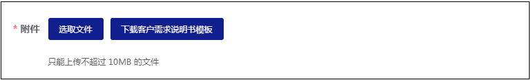
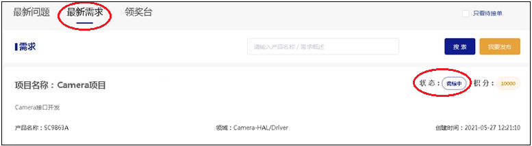
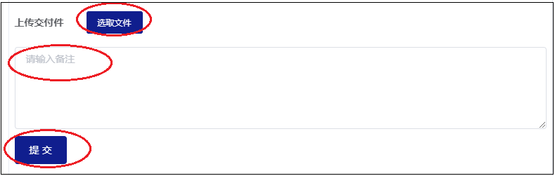

## 需求流程

### 主要流程

在坦克邦上，需求发布及验收的主要流程如下：

- 客户编辑需求，上传《需求说明书》，后台审核通过后发布需求到坦克邦任务大厅；
- 允许工程师多人竞标，工程师进行需求分解和工作量评估后提供《需求开发计划书》供客户进行确认；
- 客户综合评估或沟通后，可以选择其中一个竞标工程师进行接单，需求进入待提交状态；
- 工程师开发完成后，按照《需求说明书》中要求的交付物提供各种交付件；
- 客户按照《需求说明书》中写明的验收标准进行验收；
- 如验收通过，则需求完成；如验收不通过，则转回给工程师重新修改提交。

### 主要状态和含义

需求单的主要流程对应的状态及描述如下：

| 状态 | 描述 | 后续的操作 | Owner |
| :-------------------------------------------------------: | ---------------------------------------------------------- | ------------------------------------------------------------ | ----------------------------------------------------------- |
|                          审核中                           | 需求提交后，初始状态为“审核中”                             | 待坦克邦管理员后台审核，审核通过后，该需求在任务大厅上线     | 坦克邦管理员                                                |
|                          竞标中                           | 需求在任务大厅上线后的初始状态                             | 待工程师竞标                                                 | 工程师                                                      |
|                       等待协议签署                        | 客户选择工程师中标后，待签署委托开发协议                   | 签署委托开发协议                                             | 客户                                                        |
|                          待提交                           | 需求正式接单，工程师开发中                                 | 待提交解决方案                                               | 工程师                                                      |
|                          待验收                           | 工程师提交方案后，等待客户验收                             | 等待客户验收                                                 | 客户                                                        |
|                          已完成                           | 验收成功，该需求单完成                                     | 需求单已经完成                                               | 无                                                          |

需求单的当前状态，可以至`个人中心-发布需求-已发需求`列表进行查看。

## 发布需求

### 先完成实名认证

在坦克邦上，只有实名用户（个人实名或者企业实名）才能发布需求。如果还未进行实名，请至`个人中心-实名认证`先完成个人实名或者企业实名认证。

### 发布需求入口

发布需求的入口在`任务大厅-最新需求-我要发布`。点击`我要发布`按键，即进入需求编辑页面。

### 需求编辑

在需求编辑页面，按照要求填写需求相关信息即可。

如下几点，请特别注意：

- 为提高中标率，建议发布需求前，需求方先完成初步的需求可行性评估和需求分解

- 需求描述一定要`明确，清晰，详细`

- 认真填写《客户需求说明书》，请先下载客户需求说明书模板，填写好后上传

  
 
- `期望接单时间`

  - 建议设置稍微长一点（至少1个星期）,一旦到`期望接单截止时间`，如果该需求还没有工程师参与竞标，则会在任务大厅超时下架

- 为提高效率，减少沟通成本，如下信息务必描述清楚：

  - 需求描述
  - 产品名称/硬件平台
  - 软件版本
  - 需求领域
  - 期望交付日期
  - 交付物
  - 验收标准

### 指定接单人

勾选“是否指定接单人”按钮后，可以指定特定的接单人进行接单。

### 悬赏积分

建议根据初步的需求分解和工作量评估结果，进行定价。目前最低限制是500积分。

### 审核后上线

需求提交成功后，进入“待审核”状态，坦克邦管理员后台审核通过后，需求即在任务大厅上线，等待工程师竞标。

## 需求竞标和中标

### 需求竞标

只有认证为工程师才能参与需求竞标。在“任务大厅-最新需求”列表中，点击某个需求打开详情页面，点击“申请竞标”按键，然后上传《开发计划书》后即完成竞标。一旦有工程师竞标，需发布方会收到邮件和短信提醒。

### 需求中标

在需求发布者的`个人中心-发布需求-已发需求`列表中可以随时查看需求的当前状态，以及进行相应的操作。

点击某个需求最左边的 `>`符号，可以查看该条需求的详情，拉到详情页面最下面，可以看到当前工程师竞标情况，点击`下载项目开发计划书`下载查看竞标工程师上传的《开发计划书》，综合评估或沟通后可以选择其中一个工程师进行`确认中标`。如果对开发计划书有异议，在确认中标前也可以通过`反馈修改`与工程师沟通更新《开发计划书》。

### 签署委托开发协议

在客户选定工程师中标后，客户还需要签署《委托开发协议》。

协议签署完成后，该需求变为“待提交”状态，等待工程师开发并提交方案。

## 需求开发与提交

### 开发进度更新

在工程师的`个人中心-发布需求-已接需求`列表中点击某个需求ID，可以打开需求进度更新页面。工程师可以留言，定期更新需求开发的进展。
相应的，客户也可以在`个人中心-发布需求-已发需求`列表中点击某个需求ID，在需求进度更新页面中查看需求进度更新情况，以及给工程师留言。

### 提交交付物

工程师开发完成后，可以在`个人中心-发布需求-已接需求`的详情页面提交交付物。一旦工程师提交方案，需求发布方会收到邮件和短信提醒。

## 需求验收

工程师提交后，客户可以在`个人中心-发布需求-已发需求`的详情页面进行需求验收。验收通过后，可以点击`通过验收`，则该需求单完成，变为“已完成”状态；如果验收失败，可以选择`驳回`到工程师继续修改后提交方案。

## 其他操作

### 需求变更

在需求接单后，处于“待提交”状态时，如果需求发布方需要变更部分需求，可以在`个人中心-发布需求-已发需求`的详情页面点击`需求变更`按键进行操作。

工程师在收到需求变更要求后，可以选择`接受`或者`拒绝`该需求变更，只有工程师接受后，该需求变更才生效。

### 需求撤单

需求发布后，如有需要，需求发布方可以在`个人中心-发布需求-已发需求`列表中进行撤单。

- 在需求方选定工程师中标前，需求方可以随时撤单，全额退款；
- 在需求方选定工程师中标后，需求方撤单需要工程师同意后才能撤单，且退款金额需要扣除一定比例的坦克邦平台服务费。
