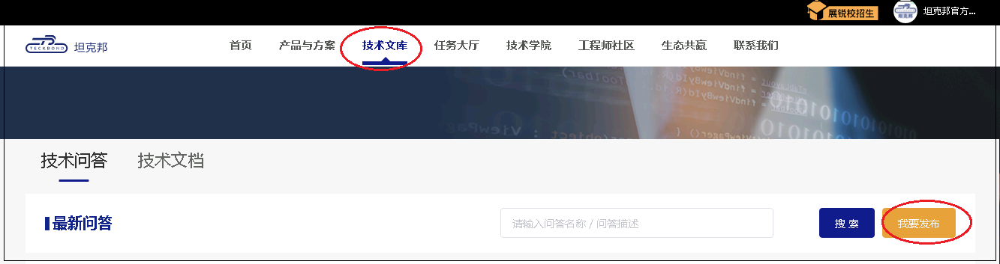
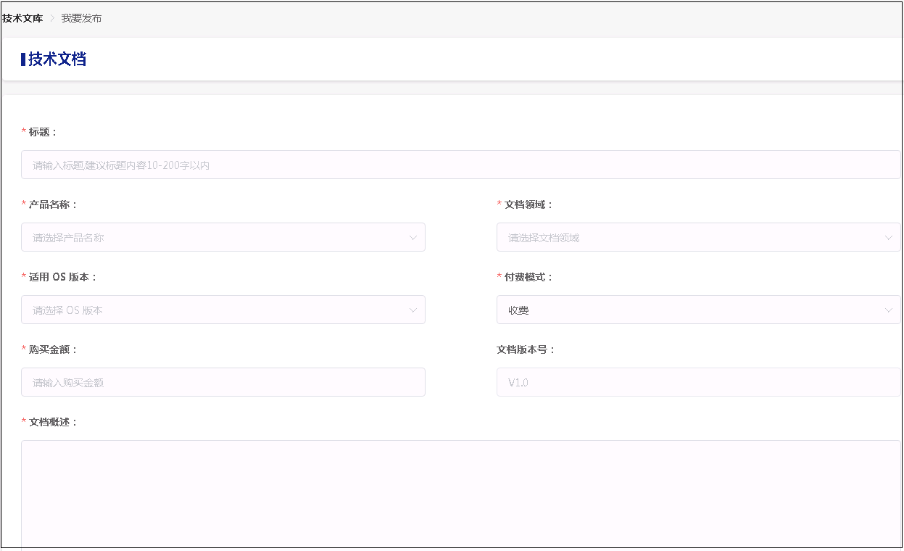
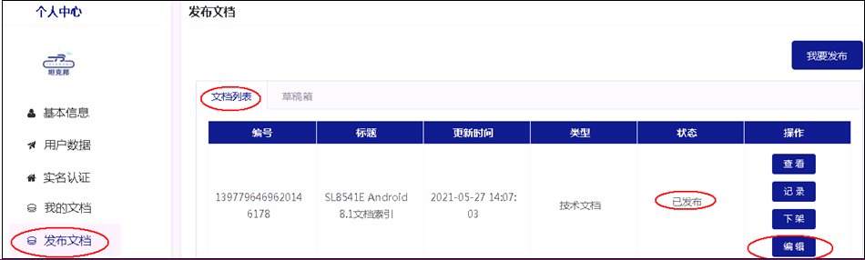
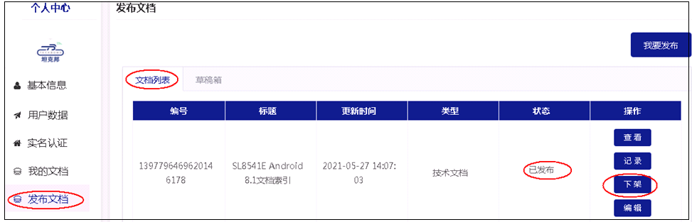
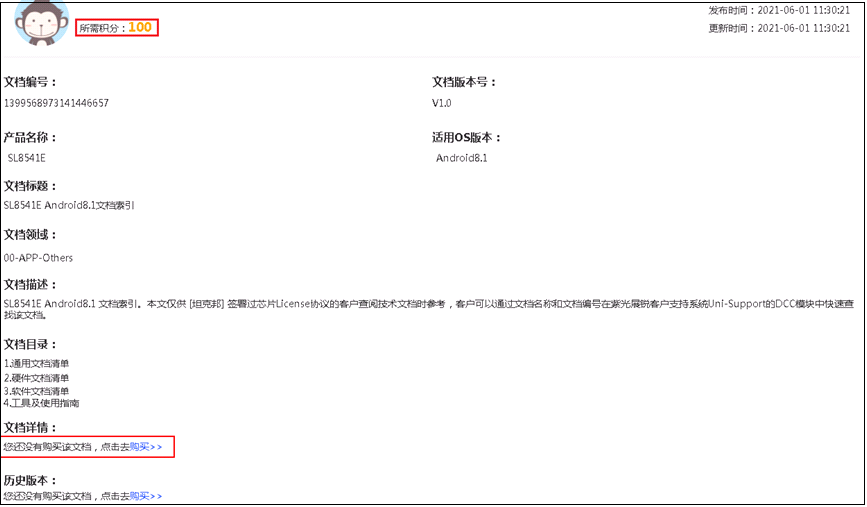
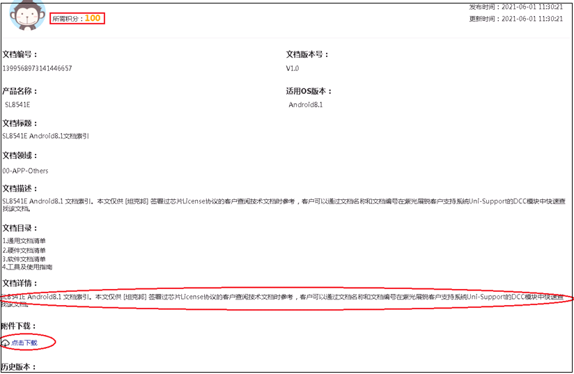

------

坦克邦技术文库提供了收费文档和问答，任何[实名认证用户](/registration#实名认证及开通电子账户)，均可以上传收费文档或问答，由用户自行定价。

暂时仅允许坦克邦平台已签署License的企业客户可以下载相应产品的文档或问答。

## 发布文档/问答

### 先完成实名认证

在坦克邦上，只有实名用户（个人实名或者企业实名）才能发布技术文档或问答。如果还未进行实名，请至“个人中心-实名认证”先完成个人实名或者企业实名认证。

### 发布文档/问答页面

发布文档/问答的入口在“技术文库-我要发布”。点击“我要发布”按键，即进入编辑页面，按照要求填写相关字段即可。

### 审核后上架

文档或问答提交成功后，进入“待审核”状态，后台合规审核或技术审核通过后，即在技术文库大厅上架。

## 更新文档/问答

发布后，发布者可以在“个人中心-发布文档-文档列表”中查看所有已经发布的文档，点击”编辑“操作对文档/问答进行重新编辑后提交，审核通过后即更新至新版本，从而实现版本迭代。
已购买者可以看到该文档/问答所有更新版本，不需再付费。

## 下架文档/问答

如有需要，发布者和坦克邦管理员可以对文档进行下架。下架后，该文档/问答在技术文库大厅不可见。

## 下载文档/问答

### 签署License协议

只有完成企业实名认证，并且线上或线下签署了当前产品License协议的客户才有下载权限。如果还未进行企业实名，请至“个人中心-实名认证”先完成企业实名认证。

### 下载

在技术文库大厅，点击某个文档/问答详情后，可以点击”购买“。

购买后，问题答案/文档详情即时可见；对于文档，还需要“点击下载”查看或下载到本地。

文档一旦下载，可以在`个人中心`->`我的文档`随时查阅。并且一次购买，可以查看文档/问答后续所有更新版本。

