# 坦克邦技术支持系统用户指南

# 使用说明

本文仅供[坦克邦](https://www.teckbond.com) [^1] 用户使用悬赏系统和技术文库等相关功能时参考，详细介绍了在坦克邦平台上进行悬赏任务发布和跟踪，需求发布、竞标、中标、提交和验收，技术文库发布和下载等的相关流程和操作方法。

[^1]:紫光展锐官方线上平台。向所有使用展锐芯片、展锐芯模块的客户和生态伙伴提供产品展示宣传、销售机会引流、工程师培训、客户技术支持平台、生态资源合作等一系列原厂服务。

如果您尚未注册成为坦克邦平台用户，推荐您使用如下方式完成注册。

- 方式一：点击下边链接进行注册：

  [**点我打开坦克邦平台注册页面**](https://www.teckbond.com/portal/html/#/home/loginDL?ex=1334379650155085825)

  

- 方式二：扫描下边二维码进行注册：

  

# 资料获取
坦克邦平台提供了各种产品相关的软件和硬件资料供客户开发参考。建议客户开发前，务必仔细查阅相关资料。
针对不同的产品类型，坦克邦提供了三种资料获取途径。

## 途径一：从“产品与方案”中获取
对于**开发板、模块和生态类产品**，可以在坦克邦主页“产品与方案”中获取相关资料。
单击“产品与方案-查看详细-资源下载”即可查看相应产品的资料，点击右侧“下载”按键即可下载。

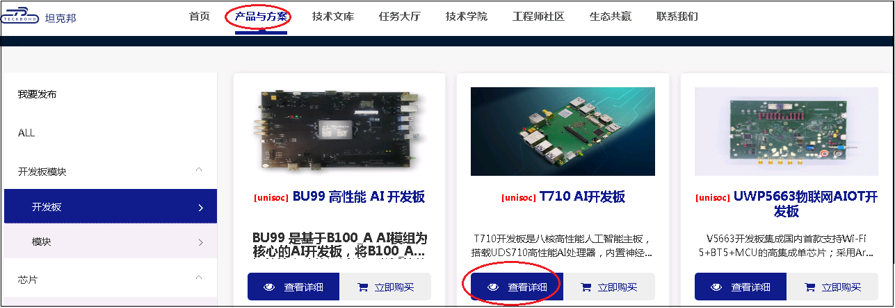

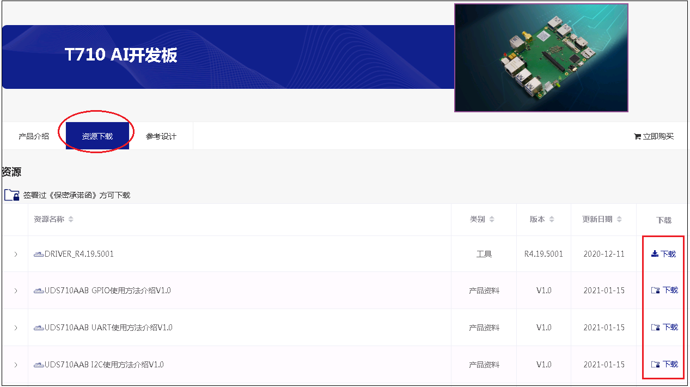

对于不同类型的资料，需要不同的下载权限。只有拥有相应权限的用户才能下载相应的资料。上图中“下载”图标的不同形状对应不同的资料类型和下载权限。

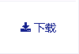：对应推广资料，注册用户都可以下载
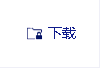：对应3级资料，完成企业实名认证，且签署NDA的用户可以下载
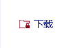：对应4级资料，完成企业实名认证，且签署相应产品License协议的用户可以下载

## 途径二：从Uni-Support获取
对于**芯片类产品**，坦克邦会给在线上或线下签署了芯片产品License协议，并完成企业实名认证的用户创建Uni-Support[^2] 账号，并开通其在Uni-Support系统上相关产品的文档和FAQ访问权限。

Uni-Support账号创建后，客户在坦克邦的注册邮箱会收到一封[客户账号创建成功]的邮件提醒，如下：

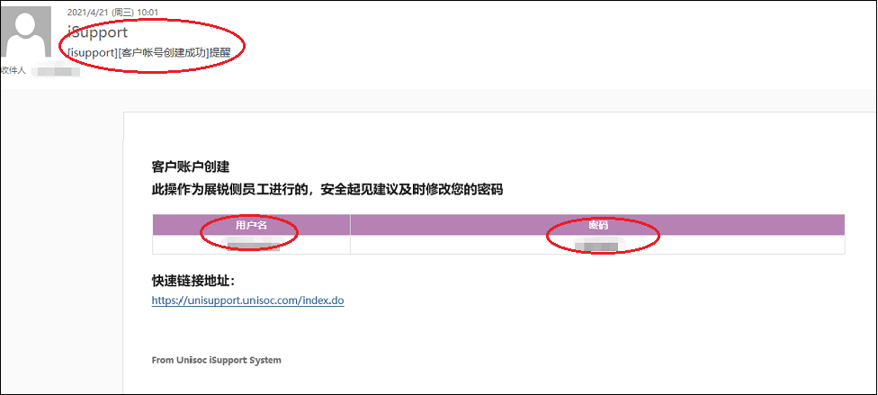

使用邮件中的“用户名”和“密码”登录[Uni-Support链接地址](https://unisupport.unisoc.com/index.do)后，可以获取相关芯片产品资料。

- DCC：文档，包含芯片规格说明书，硬件原理图，设计指导文档，调试指导文档，客制化指导手册等
- FAQ：问答，包含硬件和软件常见问题解答
- 工具管理：工具，包含展锐芯片平台所有的工具
- QVL：器件认证列表

[^2]:紫光展锐客户支持系统

## 途径三：从“技术文库”获取

坦克邦技术文库提供了收费文档和问答，是与Uni-Support差异化的文档系统。如果客户在“产品与方案”和“Uni-Support”中未找到需要的资料，可以尝试在“技术文库”中查询。具体操作方法请见“技术文库"章节。

#  技术文库
坦克邦技术文库提供了收费文档和问答，任何实名用户（个人实名或者企业实名）都可以上传收费文档或问答，由用户自行定价；目前只有坦克邦License客户可以下载相应产品的文档或问答。

## 发布文档/问答

### 先完成实名认证
在坦克邦上，只有实名用户（个人实名或者企业实名）才能发布技术文档或问答。如果还未进行实名，请至“个人中心-实名认证”先完成个人实名或者企业实名认证。

### 发布文档/问答页面
发布文档/问答的入口在“技术文库-我要发布”。点击“我要发布”按键，即进入编辑页面，按照要求填写相关字段即可。

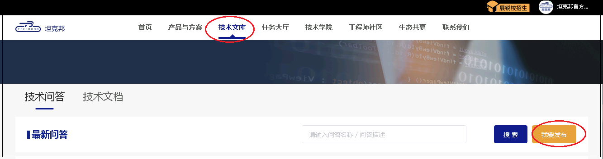

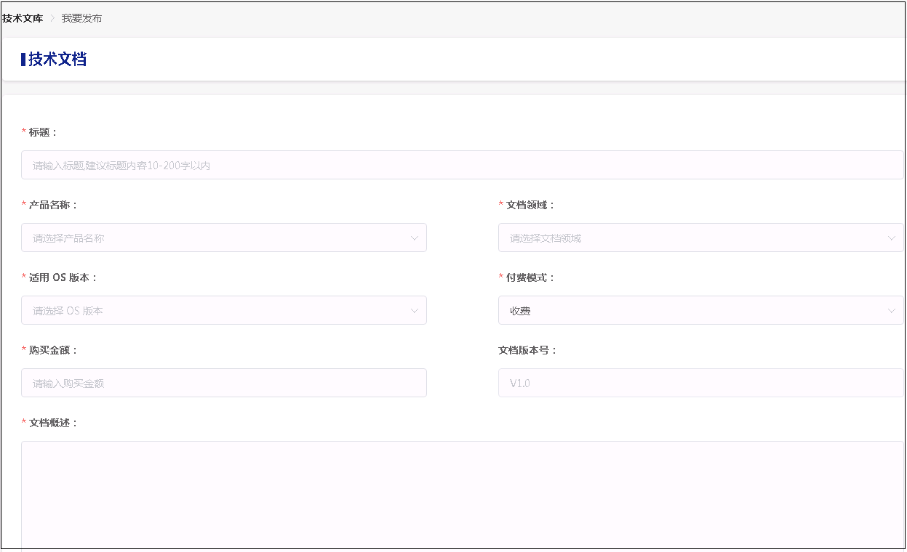

### 审核后上架

文档或问答提交成功后，进入“待审核”状态，后台合规审核或技术审核通过后，即在技术文库大厅上架。

## 更新文档/问答

发布后，发布者可以在“个人中心-发布文档-文档列表”中查看所有已经发布的文档，点击”编辑“操作对文档/问答进行重新编辑后提交，审核通过后即更新至新版本，从而实现版本迭代。
已购买者可以看到该文档/问答所有更新版本，不需再付费。

## 下架文档/问答

如有需要，发布者和坦克邦管理员可以对文档进行下架。下架后，该文档/问答在技术文库大厅不可见。

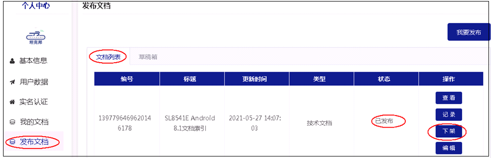

## 下载文档/问答

### 签署License协议
只有完成企业实名认证，并且线上或线下签署了当前产品License协议的客户才有下载权限。如果还未进行企业实名，请至“个人中心-实名认证”先完成企业实名认证。

### 下载
在技术文库大厅，点击某个文档/问答详情后，可以点击”购买“。

购买后，问题答案/文档详情即时可见；对于文档，还需要“点击下载”查看或下载到本地。

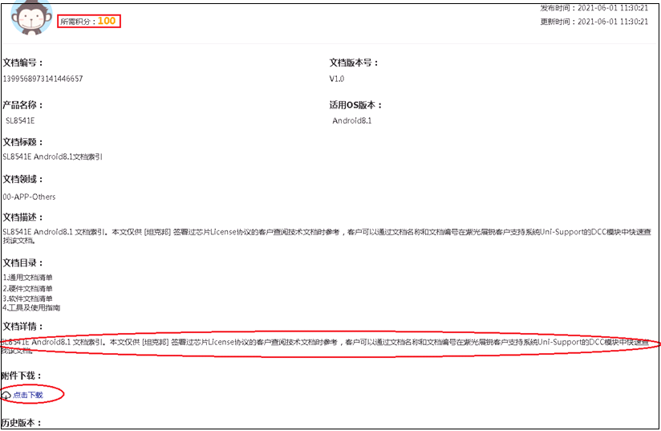

文档一旦下载，可以在“个人中心->我的文档”随时查阅。并且一次购买，可以查看文档/问答后续所有更新版本。

# 悬赏任务
线上或者线下签署产品License，登录坦克邦完成企业实名后，即可充值发布悬赏任务。

## 发布悬赏任务界面
打开个人中心，点击“发布悬赏任务”，选择Question/Bug/Task，填写任务表单
- Question为一些咨询类问题，比如“是否支持T卡热插拔”。
- Bug为常规问题支持，比如“配置了xx，还是无法打开XXX”。
- Task为调试任务，比如“Camera调试”。
- 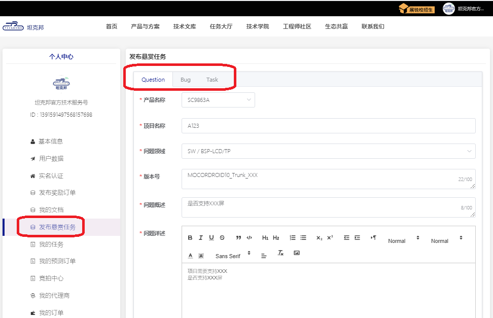

## 悬赏任务解决流程

悬赏任务解决的流程是客户发任务 -> 工程师接单

## 悬赏任务跟踪和处理

在个人中心，我的任务中查看已经发布的任务，点击任务描述可以查看沟通记录，执行操作一栏的按钮可以修改、验收和申请撤单。
- 待提交 ---- 工程师已经接单。

- 待验收 ---- 工程师已经提交方案，等待验收。

- 已完成 ---- 验收成功。

- 已驳回 ---- 验收失败。

- 超时 ---- 超过最晚接单时间，自动下架。

- 已撤单 ---- 主动撤单下架。

## 注意事项

### 产品
悬赏任务中可以选择的产品是已签了License的产品，如果产品没有显示出来，请联系销售或管理员。

### 指定接单人
发悬赏任务的时候，可以填写接单人的ID，指定给他，该接单工程师可以在24小时内接下这个单子，超过24小时，单子退到任务大厅。

### 任务描述
提交悬赏任务时，需要把版本号、问题现象、复现步骤、概率等描述清楚，并提供完整的log，最好附上截图或者视频。

### 任务积分
任务单的悬赏积分不可以修改，如需追加积分，可以另提一单，选择指定接单人给对应工程师。

# 众包需求 

## 需求流程

### 主要流程
在坦克邦上，需求发布及验收的主要流程如下：
- 客户编辑需求，上传《需求说明书》，后台审核通过后发布需求到坦克邦任务大厅；
- 允许工程师多人竞标，工程师进行需求分解和工作量评估后提供《需求开发计划书》供客户进行确认；
- 客户综合评估或沟通后，可以选择其中一个竞标工程师进行接单，需求进入待提交状态；
- 工程师开发完成后，按照《需求说明书》中要求的交付物提供各种交付件；
- 客户按照《需求说明书》中写明的验收标准进行验收；
- 如验收通过，则需求完成；如验收不通过，则转回给工程师重新修改提交。

### 主要状态和含义

需求单的主要流程对应的状态及描述如下：
| 状态 | 描述 | 后续的操作 |Owner|
| :----------------------------------------------------: | ------------------------------------------------------------ | ------------------------------------------------------------ |
|审核中|需求提交后，初始状态为“审核中”| 待坦克邦管理员后台审核，审核通过后，该需求在任务大厅上线 |坦克邦管理员|
|竞标中|需求在任务大厅上线后的初始状态|待工程师竞标|工程师|
|等待协议签署|客户选择工程师中标后，待签署委托开发协议 |签署委托开发协议|客户|
|待提交|需求正式接单，工程师开发中|待提交解决方案 |工程师|
|待验收|工程师提交方案后，等待客户验收|等待客户验收|客户|
|已完成|验收成功，该需求单完成|需求单已经完成|无|

需求单的当前状态，可以至“个人中心-发布需求-已发需求”列表进行查看。

## 发布需求 

### 先完成实名认证
在坦克邦上，只有实名用户（个人实名或者企业实名）才能发布需求。如果还未进行实名，请至“个人中心-实名认证”先完成个人实名或者企业实名认证。

### 发布需求入口
发布需求的入口在“任务大厅-最新需求-我要发布”。点击“我要发布”按键，即进入需求编辑页面。

### 需求编辑

在需求编辑页面，按照要求填写需求相关信息即可。

如下几点，请特别注意：
- 为提高中标率，建议发布需求前，需求方先完成初步的需求可行性评估和需求分解

- 需求描述一定要明确，清晰，详细

- 认真填写《客户需求说明书》，请先下载客户需求说明书模板，填写好后上传

    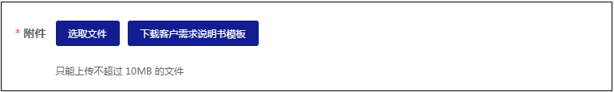

- 为提高效率，减少沟通成本，如下信息务必描述清楚：
    - 需求描述
    - 产品名称/硬件平台
    - 软件版本
    - 需求领域
    - 期望交付日期
    - 交付物
    - 验收标准

### 指定接单人
勾选“是否指定接单人”按钮后，可以指定特定的接单人进行接单。

### 悬赏积分

建议根据初步的需求分解和工作量评估结果，进行定价。目前最低限制是500积分。

### 审核后上线
需求提交成功后，进入“待审核”状态，坦克邦管理员后台审核通过后，需求即在任务大厅上线，等待工程师竞标。

## 需求竞标和中标

### 需求竞标
只有认证为工程师才能参与需求竞标。在“任务大厅-最新需求”列表中，点击某个需求打开详情页面，点击“申请竞标”按键，然后上传《开发计划书》后即完成竞标。一旦有工程师竞标，需发布方会收到邮件和短信提醒。

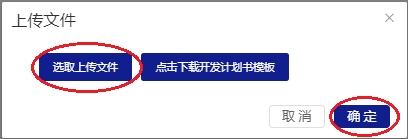

### 需求中标

在需求发布者的“个人中心-发布需求-已发需求”列表中可以随时查看需求的当前状态，以及进行相应的操作。

点击某个需求最左边的 ">" 符号，可以查看该条需求的详情，拉到详情页面最下面，可以看到当前工程师竞标情况，点击“下载项目开发计划书”下载查看竞标工程师上传的《开发计划书》，综合评估或沟通后可以选择其中一个工程师进行“确认中标”。如果对开发计划书有异议，在确认中标前也可以通过“反馈修改”与工程师沟通更新《开发计划书》。

### 签署委托开发协议

在客户选定工程师中标后，客户还需要签署《委托开发协议》。

协议签署完成后，该需求变为“待提交”状态，等待工程师开发并提交方案。

## 需求开发与提交

### 开发进度更新
在工程师的“个人中心-发布需求-已接需求”列表中点击某个需求ID，可以打开需求进度更新页面。工程师可以留言，定期更新需求开发的进展。
相应的，客户也可以在“个人中心-发布需求-已发需求”列表中点击某个需求ID，在需求进度更新页面中查看需求进度更新情况，以及给工程师留言。

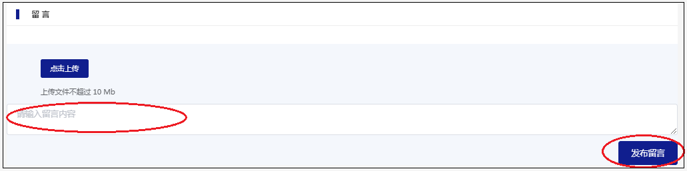

### 提交交付物

工程师开发完成后，可以在“个人中心-发布需求-已接需求”的详情页面提交交付物。一旦工程师提交方案，需求发布方会收到邮件和短信提醒。

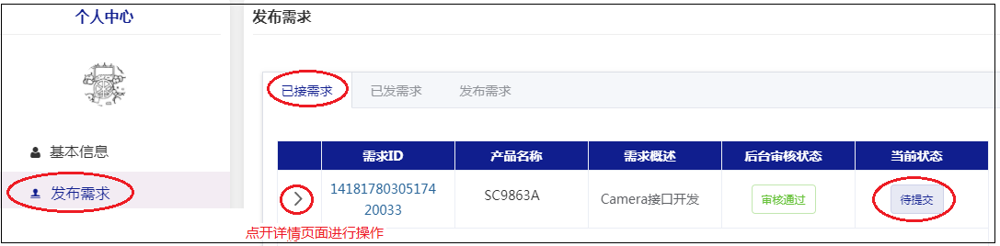

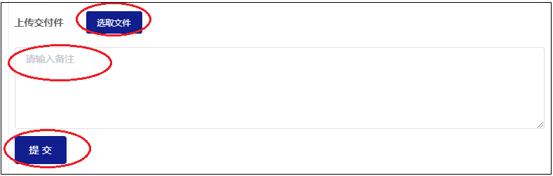

## 需求验收

工程师提交后，客户可以在“个人中心-发布需求-已发需求”的详情页面进行需求验收。验收通过后，可以点击“通过验收”，则该需求单完成，变为“已完成”状态；如果验收失败，可以选择“驳回”到工程师继续修改后提交方案。

## 其他操作 

### 需求变更
在需求接单后，处于“待提交”状态时，如果需求发布方需要变更部分需求，可以在“个人中心-发布需求-已发需求”的详情页面点击“需求变更”按键进行操作。

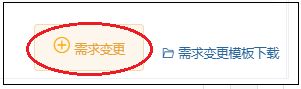

工程师在收到需求变更要求后，可以选择“接受”或者“拒绝”该需求变更，只有工程师接受后，该需求变更才生效。

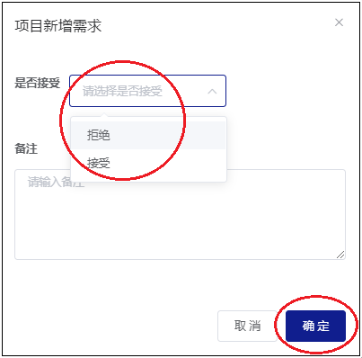

### 需求撤单

需求发布后，如有需要，需求发布方可以在“个人中心-发布需求-已发需求”列表中进行撤单。
- 在需求方选定工程师中标前，需求方可以随时撤单，全额退款；
- 在需求方选定工程师中标后，需求方撤单需要工程师同意后才能撤单，且退款金额需要扣除一定比例的坦克邦平台服务费。

